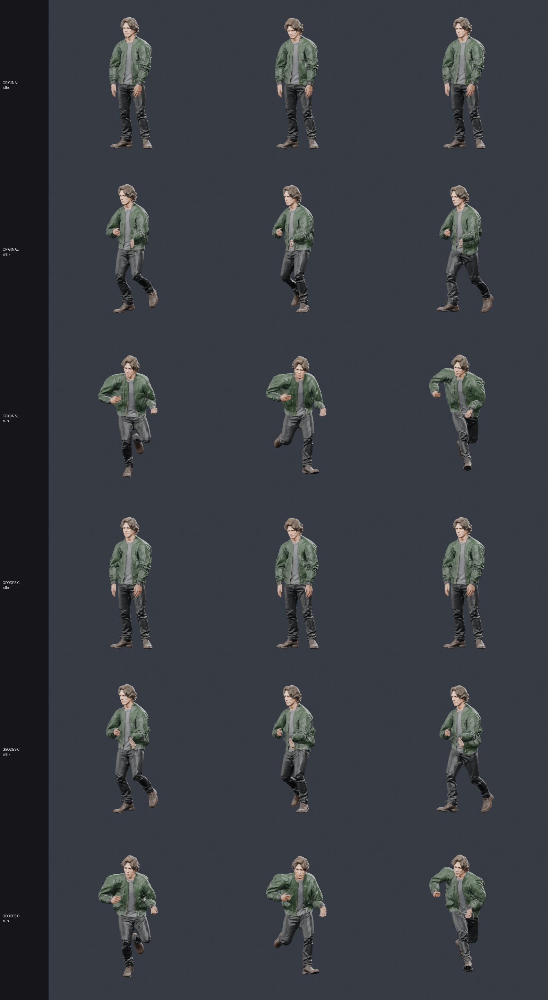
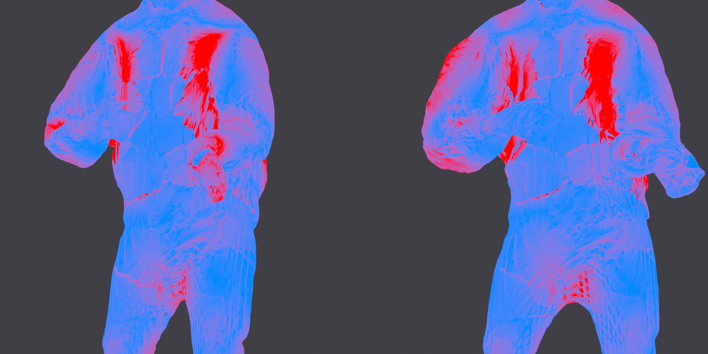

# CharForge

A text prompt goes in; a rigged, animated, game-ready character comes out. Everything runs
locally on an Apple Silicon laptop — generation, segmentation, retopology, rigging, skinning and
animation. No cloud calls in the mesh path.

**[▶ Open the live playground](https://majieddd.github.io/charforge/)** — WASD to move, Shift to
run, Space to jump, E to wave. 77,768 triangles, 25 bones, five clips. There is a toggle for
dual-quaternion vs. linear blend skinning so you can see the difference the skinning algorithm
makes on the same mesh and the same weights.

<p align="center">
  
</p>

## What it does

| stage | what happens | script |
|---|---|---|
| generate | TRELLIS.2-4B via MLX, with **stochastic multi-view conditioning** — each denoising step is conditioned on a different view, which is the scheme the model was trained for | `pipeline/mv_condition.py` + [patch](patches/) |
| segment | eight orbit renders, a SegFormer pass per view, exact-visibility back-projection to per-vertex part labels | `pipeline/parts.py` |
| retopologise | marching-cubes surface → watertight quad mesh, 4K albedo and normal baked from the high-resolution original | `blender/retopo.py` |
| re-label | part labels carried onto the new mesh by nearest-vertex lookup, then a Lab-colour pass that moves skin-coloured faces out of the hair group | `pipeline/transfer_labels.py` |
| rig | skeleton fitted, weights solved, T-pose baked | `blender/rig_retopo.py`, `blender/tpose.py` |
| animate | Mixamo captures retargeted by world-space rest delta | `blender/retarget.py` |
| verify | per-bone deformation audit over every frame of every clip | `blender/deform_audit.py` |
| ship | glTF export, three.js playground | `blender/web_export.py`, `web/` |

## Measured, not asserted

Every claim here has a script behind it that you can re-run.

**Topology matters more than anything else.** The pipeline originally rigged the raw
marching-cubes surface: 2.30% open edges, 0.48% non-manifold, 0.29% zero-area faces. The
retopologised mesh is 0.00% on all three. That single difference explains bone-heat failing at
100%, QuadriFlow silently no-op'ing, cloth simulation diverging at 8,438%, and the face tearing
under animation.

**Dual quaternion skinning is worth more than any weighting scheme we tried.** Same mesh, same
weights, viewer-side only:

| | linear blend | dual quaternion |
|---|---|---|
| jacket faces under half rest area, walk | 8.80% | **6.18%** |
| same, run | 11.49% | **5.96%** |
| skin, walk | 0.79% | **0.11%** |

<p align="center">
  
</p>

Blue holds its rest area, red has collapsed or ballooned. Left is linear blend, right is dual
quaternion, same frame. The legs and head are clean; what is left is the jacket chest panel and
the shoulder.

**Anatomically "correct" weights can be worse than smooth ones.** Ray-visibility tests, a
bilateral (left/right) prior and a skeleton-graph spread bound all drove the obvious purity
metric to zero and made the character visibly worse, because each is a *binary per-vertex mask*:
two neighbouring vertices land on opposite sides of a grazing test, their weights diverge, and
the surface tears between them.

| weights | skin, median per-bone p99 stretch | clothing |
|---|---|---|
| plain inverse-distance (shipped) | **16.4%** | **75.9%** |
| + ray visibility + bilateral prior | 141.3% | 129.3% |
| + skeleton-graph spread bound | 44.3% | 123.6% |
| geodesic distance along the surface | 21.4% | 73.0% |

Smoothness of the weight field beats anatomical purity of any single vertex. See
[CONTRIBUTING.md](CONTRIBUTING.md) for what this implies about the remaining work.

**Exclude hidden faces from any collapse metric.** Only 56% of collapsed jacket faces are
externally visible, against an 86.5% baseline — the collapse concentrates in the t-shirt layered
under the jacket, where it costs nothing. The honest visible figure is 4.93%, not 8.80%.

## Running it

Requires macOS on Apple Silicon, Blender 5.x on `PATH`, and Python 3.11+.

```bash
python3 -m venv .venv && .venv/bin/pip install -r requirements.txt
```

The generation stage needs [trellis2mlx](https://github.com/lyonsno/trellis2mlx) checked out
alongside, with the stochastic multi-view patch applied:

```bash
git clone https://github.com/lyonsno/trellis2mlx vendor/trellis2mlx
git -C vendor/trellis2mlx apply ../../patches/trellis2mlx-stochastic-multiview.patch
```

Then `./run_pipeline.sh`. Individual stages are runnable on their own; every Blender stage takes
`--blend in.blend --out out.blend` and prints what it measured.

To re-run just the verification on a built character:

```bash
blender -b -noaudio --python blender/deform_audit.py -- \
    --blend work/char01/final.blend --out audit.json
```

## Honest limitations

- The hair reads as a solid mass rather than strands, and the face is smooth rather than
  sculpted. That is the generative stage, not the pipeline — more conditioning views or a higher
  TRELLIS sampling grid are the levers.
- The albedo is upsampled from TRELLIS's native 1024. 4K buys texel density and less UV-island
  bleed; the normal map is where 4K actually pays.
- Cloth simulation was implemented and then removed. On a single connected garment pinned only at
  the top it diverged and blew the legs apart by walk frame 14. The garment is skinned, which is
  what most shipped game characters do anyway.
- There is no facial rig. The head travels as one piece.
- The web build is a 22 MB download. That is deliberate — full 4K quality — but it is not a
  mobile-friendly default.

## Assets and licensing

The **code** in this repository is MIT (see [LICENSE](LICENSE)).

The **character mesh and textures** are generated output and carry no third-party rights beyond
the generating model's own terms (TRELLIS.2, MIT).

The **animation clips are derived from Mixamo captures** (via the `jasongzy/Mixamo` mirror on
HuggingFace) and retargeted onto this skeleton. Mixamo content is Adobe's; their licence permits
use in projects but not redistribution as stock animation content. The clips here are baked,
retargeted derivatives shipped as part of a demo, which is the ordinary use case — but if you
intend to build on this commercially, pull your own clips from
[mixamo.com](https://www.mixamo.com) with `blender/retarget.py` rather than relying on what is
committed here. Open an issue if you are the rights holder and want this removed.

## Repository layout

```
blender/     Blender stages: retopology, rigging, skinning, retargeting, auditing, rendering
pipeline/    generation, segmentation, label transfer, gates
patches/     the stochastic multi-view conditioning patch for trellis2mlx
web/         the three.js playground (base64 build, for hosts that will not serve .glb)
docs/        GitHub Pages build — same playground, fetching the .glb directly
results/     rendered comparisons and the raw audit JSON behind the numbers above
```
