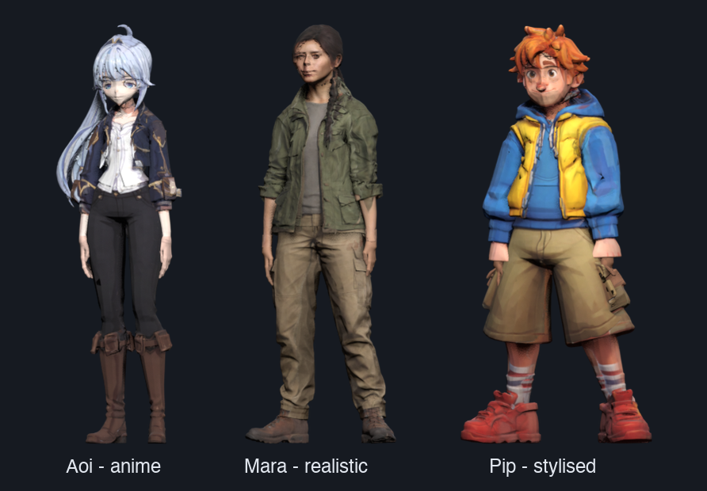
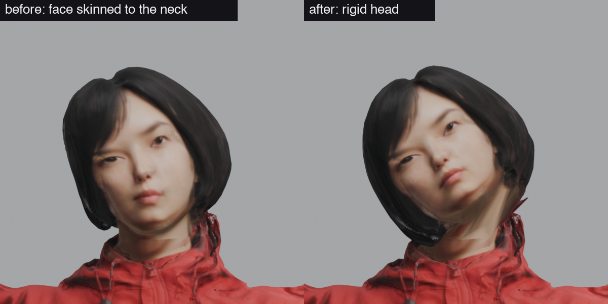
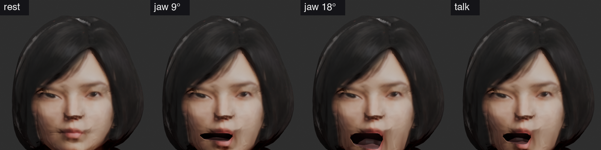
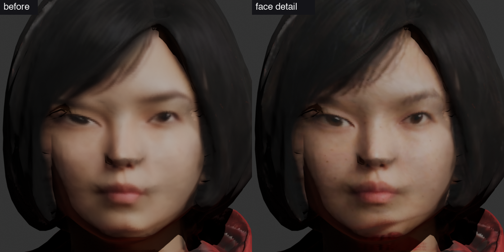

# CharForge

A text prompt or an image goes in; a rigged, animated character comes out that you can drop into
a game engine - glTF and FBX, a Mixamo skeleton with fingers and a jaw, a face that blinks and
talks, PBR textures, level-of-detail meshes and a manifest of everything a character controller
needs. It works in three art styles - realistic, anime and stylised - with one pipeline, and
everything runs locally on an Apple Silicon laptop: image generation, 3D generation, segmentation,
the solid, retopology, hands, rigging, skinning, the face rig, texture projection, retargeting
and packaging.

**[▶ Open the live playground](https://majieddd.github.io/charforge/)** - a small game level with
a character controller driving the generated characters. <kbd>W</kbd><kbd>A</kbd><kbd>S</kbd><kbd>D</kbd>
moves relative to the camera (strafes and back-pedals included), <kbd>Shift</kbd> sprints,
<kbd>X</kbd> walks, <kbd>C</kbd> crouches, <kbd>Space</kbd> jumps (fall off the platform for the
hard landing), hold <kbd>Q</kbd> or the right mouse button to aim - the character faces the camera
and strafes - <kbd>E</kbd> waves, the number keys play moves made from a video, hold <kbd>T</kbd> to talk. Swing the camera and the character
turns in place. Each character downloads only when selected; **Download** fetches its package.

**[📄 Read the paper](https://majieddd.github.io/charforge/paper/)** - *CharForge: rigged, animated game characters
from a few words or one image, on a laptop*, a living research paper: the method stage by stage, every measurement
(regenerated from the pipeline's own files), related work with sources, negative results and the roadmap. Beside it:
the [lab notebook](https://majieddd.github.io/charforge/paper/notebook.html) (the day-by-day record) and the
[experiment tracker](research/TRACKER.md) (what is planned, running, done and dropped - start there to pick the work
up). Rebuild the paper with `python paper/collect.py && python paper/build.py`.

<!--ROSTER-->
| | style | made from | height | triangles (LOD0 / 1 / 2) | face | package |
|---|---|---|---|---|---|---|
| **Aoi** | anime | *"a young anime adventurer girl with a long high ponytail of silver-blue hair, a short fitted navy jacket with gold trim over a white shirt, fitted black trousers and knee-high brown leather boots"* | 1.62 m | 76,578 / 30,631 / 11,485 | jaw, blink, brows_up, pucker, smile | [aoi.zip](https://github.com/majieddd/charforge/releases/download/v3.0.0/aoi.zip) |
| **Mara** | realistic | *"a young woman field researcher with a long dark brown braided ponytail, a fitted olive green field jacket with the sleeves rolled to the forearm, a grey t-shirt, tan cargo trousers and brown leather hiking boots"* | 1.68 m | 69,434 / 27,773 / 10,414 | jaw, blink, brows_up, pucker, smile | [mara.zip](https://github.com/majieddd/charforge/releases/download/v3.0.0/mara.zip) |
| **Pip** | stylized | *"a cheerful cartoon courier with messy orange hair and freckles, a puffy yellow vest over a blue hoodie, baggy khaki cargo shorts, striped socks and chunky red sneakers"* | 1.55 m | 78,233 / 31,293 / 11,733 | jaw, blink, brows_up, pucker, smile | [pip.zip](https://github.com/majieddd/charforge/releases/download/v3.0.0/pip.zip) |
| **Juno** | realistic | *"a woman in a red hooded windbreaker, grey cargo trousers and black hiking boots, with a short black bob haircut"* | 1.70 m | 66,015 / 26,406 / 9,902 | jaw, blink, brows_up, pucker, smile | [juno3.zip](https://github.com/majieddd/charforge/releases/download/v3.0.0/juno3.zip) |
| **Rowan** | realistic | *"a man in a green bomber jacket with medium-length wavy hair"* | 1.78 m | 67,217 / 26,886 / 10,082 | jaw, blink, brows_up, pucker, smile | [rowan.zip](https://github.com/majieddd/charforge/releases/download/v3.0.0/rowan.zip) |
| **Wren** | realistic | *"a woman in a brown leather jacket with a satchel and a braid"* | 1.68 m | 64,617 / 25,846 / 9,692 | jaw, pucker, smile | [wren.zip](https://github.com/majieddd/charforge/releases/download/v3.0.0/wren.zip) |
| **Vex** | stylized | made from a painted concept image, no prompt | 1.72 m | 63,979 / 25,591 / 9,596 | jaw, blink, brows_up, pucker, smile | [vex.zip](https://github.com/majieddd/charforge/releases/download/v3.0.0/vex.zip) |
| **Knight** | realistic | *"a young knight in dented steel plate armour over a blue surcoat, short blond hair, leather gloves and brown leather boots"* | 1.80 m | 67,380 / 26,951 / 10,107 | jaw, blink, brows_up, pucker, smile | not in a release yet |
| **Kaito** | anime | *"an anime ninja boy with spiky black hair, a long red scarf, a fitted dark blue jacket with a belt, black trousers wrapped at the shins and split-toe boots"* | 1.70 m | 72,646 / 29,057 / 10,896 | jaw, blink, brows_up, pucker, smile | not in a release yet |
| **Bo** | stylized | *"a cheerful cartoon chef with a tall white chef's hat, round glasses and a thick moustache, a white double-breasted chef jacket, black-and-white checked trousers and red clogs"* | 1.60 m | 59,981 / 23,991 / 8,997 | - | not in a release yet |
<!--/ROSTER-->

## Three styles, one pipeline

<p align="center">
  
</p>

Aoi, Mara and Pip were made to test one claim: nothing in the pipeline is tuned to a look. Each
came from a single prompt and `--style`, which decides how the reference image is asked for, how
the side and back views are repainted, what the face finder expects (drawn eyes are bigger, drawn
mouths are faint lines) and how the manifest asks an engine to shade it (the playground cel-shades
the anime character with an ink outline). Every other stage is the same code.

They also broke things no realistic character had, which is the point of making them. The pose
model read Aoi's jacket cuffs as her wrists and put her mouth on her eyelids; Pip's cartoon hands
have separate fingers, so "the wrist is the thinnest section" found a finger; his cargo shorts'
hem stopped the leg tracer. Each of those is now a rule that holds for all seven characters -
[REVIEW.md](REVIEW.md), third pass.

## What you get

`python charforge.py make --name mara --style realistic --prompt "..."` writes `out/mara/`:

| file | what it is |
|---|---|
| `mara.glb` | the character: mesh, 64-bone Mixamo skeleton (fingers and a jaw), face morph targets, baked PBR material, 18 clips - for Unreal, Godot, three.js and anything that reads glTF |
| `mara.fbx` | the same for Unity, with `_LOD0`/`_LOD1`/`_LOD2` meshes that Unity turns into an LOD Group on import |
| `textures/` | 4K `albedo`, `normal` (OpenGL) and `normal_directx` (Unreal), `orm` (occlusion/roughness/metallic), and Unity's `metallic_smoothness` + `occlusion` |
| `mara.json` | the manifest: height, collision capsule, art style and how to shade it, the face (jaw bone, morphs, how to drive them), spring chains, and per clip its length, looping, ground speed, travel direction, turn angle, and where the left foot strikes |
| `reference.png` | the image the character was generated from |

**Conventions**, as an engine expects them: metres, Y-up in glTF, facing +Z; origin on the floor
under the pelvis; T-pose rest; bones named `mixamorig:*` (Unity's Humanoid mapper and every
Mixamo preset recognise them, fingers included); clips baked at 60 fps **in place**, with the
speed and direction to move the character recorded in the manifest.

**The clips** (18): idle; walk, jog, run and sprint on one stride clock, so a controller blends
them by speed; walk and jog backwards; strafe left and right; turn left, right and 180 in place;
crouch idle and crouch walk; jump, fall loop and hard landing; wave. Mixamo captures, chosen by
measurement and retargeted with the feet planted.

**The face**: a `jaw` bone, and morph targets `blink_L`, `blink_R`, `smile`, `brows_up` and
`pucker`, all at rest by default. The mouth is cut open along the lips with a mouth behind it,
so the jaw opens it instead of stretching the lips. Clips never key the face; a game drives it on
top of any clip (the manifest says how - the playground blinks every few seconds and talks while
<kbd>T</kbd> is held).

**Hands** are modelled, not generated: the generator's fused paddles are cut off at the wrist and
replaced by a hand with fingers and 15 finger bones, posed and sized to the arm.

**Engine setup** is in the manifest (`materials.per_engine`); in short:

- **Unreal** - import the `.glb` or `.fbx`. Base Color = `albedo`, Normal = `normal_directx`,
  and `orm` plugs straight into Unreal's own occlusion/roughness/metallic packing.
- **Unity (URP or Built-in)** - import the `.fbx`, set Rig to *Humanoid* (the names auto-map),
  Base Map = `albedo`, Normal Map = `normal`, Metallic = `metallic_smoothness`, Occlusion =
  `occlusion`. The face morphs arrive as blend shapes.
- **Godot 4** - import the `.glb`; materials, morphs and animations are wired, and Godot builds LODs.

## Make your own

**With the Studio** - a local web app for everything below, no terminal needed after starting it:

```bash
python charforge.py studio            # opens http://localhost:8830; or double-click "CharForge Studio.command"
```

Type a description - a few words is enough - or drop in an image, pick a style, and press Make.
**Write it out** first shows what the image model will be asked for: your words completed by a local
language model with an age and a build, skin and hair, and each garment in its own colour, to edit
before anything is drawn; the height follows from it unless you set one, and a name that is already
taken is refused on the spot (it would have given back the old character). The job queue
runs one character at a time, shows each stage as it happens with the time left, and keeps the
log. Every character gets a page - turn it round in 3D, play its clips, download the `.glb` and
`.fbx`, add moves from video, rerun from any stage, record a short reel of it moving, render it in
the poses that break things (to check a build), watch any clip from the front, the side and above at
once with its joints read out, a frame at a time with `,` and `.` (**Angles**) - and **Walk around** opens the playground with
every character on this Mac (not only the published ones) at `/play/`. The Studio can be
closed and reopened while a job runs: it finds the job again and waits for it. Setup checks
Blender, ComfyUI, TRELLIS, the models and the local language model that writes prompts out, and
says what is missing.

**From the terminal**:

```bash
python charforge.py make --name mara --height 1.68 --style realistic --prompt "a young woman field researcher"
python charforge.py make --name vex  --height 1.72 --style stylized  --image concept_art.png
python charforge.py make --name mara --from rig        # rerun from a stage; style, height, prompt are remembered
python charforge.py stages                            # what each stage does and writes
```

A short prompt is first written out (`pipeline/describe.py`): a local language model through
Ollama - Gemma 4 e4b by default (of nine compared, with gemma2 9B the best at following the rules), `CF_DESCRIBE_MODEL` / `CF_DESCRIBE_URL` for another, or any server
with the OpenAI chat API such as LM Studio - fills in an age and a build, skin, hair and face, and the
top, the bottom and the shoes each with its own colour, and the sentence is put together from those
fields. A field naming a prop, a pose or a height is dropped, and the age group comes from your own
words. Without a model, a fixed template asks the image model for the same things. `--literal` keeps a
prompt as written; one of 20 words or more is used as it is. ("A boy scout" had come back a grown man
at an adult height, and "a gray alien, extremely muscular" a grey clay sculpture with no clothes.)
It is then turned into a reference image in ComfyUI - by Qwen-Image 2.1, which draws the
figure with its own transparent background, so the 3D model and the texture stage take its exact
cut-out instead of a background remover's guess (`--image-model krea2` for Krea 2); an image is
used as given. Measured on six characters, same prompt and seed (`results/v3/image_models`): Krea
drew one figure with no head or legs and cut one off at the edge, Qwen none; Qwen needs the A-pose
angle spelled out (its hands otherwise hang 0.28-0.37 torso lengths from the hips, against Krea's
0.61-0.72; with it, 0.58-0.70); about 6 minutes an image against Krea's 4-5 on the M5.
Generation takes about 25 minutes on an M-series laptop (two TRELLIS passes and the image model),
the rest 10-15. Every stage writes to `work/<name>/` and is skipped next time if that output
exists; `--from <stage>` reruns from any point and `--until <stage>` stops early.

**Driving it, or checking a build**: [`.claude/skills/charforge/SKILL.md`](.claude/skills/charforge/SKILL.md)
is the runbook - what the program decides by itself, the eight things to look at after a build
(each with what good looks like and what to do if not), and which stage to rerun after which
change. It is written so a person or a model can follow it; Claude Code loads it automatically
in this repository.

| stage | what happens | script |
|---|---|---|
| reference | a short prompt written out (age, build, skin, hair, each garment's colour), then a full-body reference image, or your image as is; drawn again (up to three times) when a pose model finds the hands against the body - they would fuse to it | `pipeline/describe.py`, `pipeline/comfy.py`, `pipeline/pose_gate.py` |
| generate, multiview | TRELLIS.2 via MLX; side and back views repainted and fed back as stochastic multi-view conditioning; each pass checked from the front against the picture, and made again - through TRELLIS's background remover, then on a new seed - when it is not a match (the picture's backdrop built in as a board); retried in smaller GPU pieces if macOS stops a long one | `vendor/trellis2mlx`, [patch](patches/) |
| views, parts | eight orbit renders; a human parser per view, back-projected to body / clothing / hair / accessory labels; hair the parser calls "hat" or "bag" relabelled by colour | `pipeline/parts.py` |
| skeleton | joints from a pose model on the front and side views | `pipeline/skeleton.py` |
| solidify | the generated shell becomes one solid: inside is what cannot see out along 3 of 26 directions; hair flakes closed where hair is nearest | `pipeline/solidify.py` |
| joints | every limb traced through the solid to its tip; wrists where the palm rounds or enters a sleeve; elbows by proportion; midline from the legs | `pipeline/refine_joints.py` |
| hands, arms | the generated hands cut off at the wrist, modelled hands with fingers joined on, one length for both; each arm cut free of whatever it was generated against below the armpit (a vest's side, a hip), thin webs the generator stretched between arm and body taken away, then checked slab by slab and cut again where it still reaches the body | `pipeline/cut_hands.py`, `pipeline/free_arms.py`, `blender/hands.py` |
| retopo, labels, texclean | 60k-triangle mesh; UVs checked for islands folded onto themselves and those faces unwrapped again; albedo, normal, roughness/metallic and AO baked; skin painted onto clothing removed | `blender/retopo.py`, `pipeline/texture_cleanup.py` |
| texture | the source images projected back onto the mesh (not beside the outline of anything nearer, in the generated views); the face read from a detailed close-up; the modelled hands in the face's skin tone; surfaces the arm cut opened coloured from the nearest old surface along the mesh | `pipeline/project_texture.py`, `pipeline/face_detail.py` |
| weights, rig | weights measured through the body; below the armpit the arm's weight only on the arm; a vest's armhole with the collarbone and a jacket's hem with the pelvis where their colours tell them from the sleeve and the trousers; loose pieces (a detached sole, a hair spike) ride with the body part they sit on; finger bones at the modelled knuckles; head rigid to the jaw line; rigid shoes; one leg each | `pipeline/geodesic_weights.py`, `blender/rig_build.py` |
| springs | bone chains for what hangs free | `blender/springs.py` |
| frame, tpose | metres, soles on the floor, origin under the pelvis; T rest pose, hands squared | `blender/normalize_frame.py`, `blender/tpose.py` |
| face | landmarks (chin, nose, mouth, eyes, checked), mouth cut open, jaw, five shapes | `pipeline/face_landmarks.py`, `blender/face_rig.py` |
| animate | 18 clips retargeted: heading and travel direction, feet planted with leg IK | `blender/retarget.py` |
| package, web | Mixamo names, glTF + FBX with LODs, engine texture variants, manifest; 2K WebP build | `blender/package.py`, `tools/optimize_glb.py` |

## Moves from a video

The chain is text → image → a video of the character moving → motion → the rig, and
`charforge.py move` runs all of it for a finished character:

```bash
python charforge.py move --name mara --move punch_combo                   # generate, read, rig, preview
python charforge.py move --name mara --move punch_combo,spell_cast        # several moves, rigged once
python charforge.py move --name aoi --move punch_combo --performer mara   # Mara's video, on Aoi
python charforge.py move --name wren --move dance --video my_clip.mp4     # your own video
```

1. **Video** (`pipeline/motion_video.py`). The character's reference image and a move from
   `animations/motion_prompts.json` go to MiniMax H3's reference-to-video model in ComfyUI. The
   prompt is MiniMax's six-section format with the move written as timed beats - ready, the move,
   recovery - and the camera locked off on the whole body in a plain studio, because a pose model
   has to see every joint in every frame. 5 s at 512 × 768, 4 steps with the turbo LoRA. H3
   makes sound with the picture; it is kept as the move's WAV.
2. **Motion** (`pipeline/video_motion.py --fit`). The figure is cut out of every frame and ViTPose
   reads it. The nearest of 2,453 Mixamo captures is found - camera angle, mirror and timing
   included. Then, only if that capture misses the video by more than the pose model's jitter,
   each bone is turned to follow the video, on the video's own body: where it points in the image
   comes from the video, and how far it reaches toward the camera - which one camera cannot see -
   from its length, as long as the video shows it at its longest. (Fitted with the capture's
   lengths instead, Aoi's short torso came out as a 28° lean back.) The length fixes a bone's depth
   only up to its sign, so an arm's two bones choose their sides together: not an elbow folded past
   150-160° (the capture library's pass 150° in 0.05% of frames) and not a wrist behind the torso
   within the chest's width and height - with the capture's side for her upper arm, Aoi's hands met
   in front of her chest through an elbow folded to 176°. The head turns to the video's
   face - nose, eyes and ears, against where the pose model finds them on the character's own
   head (`tools/calibrate_joints.py`). `blender/fit_clip.py` writes the result as a Mixamo FBX.
   DWPose (`tools/dwpose.py`) reads the hands - 21 points each, where ViTPose's 17 stop at the wrist.
3. **Rig**. The new clip is retargeted with the rest, and the character's limbs, spine and head
   are then aimed along the fitted points: copying rotations from one skeleton to another carries
   the two rest poses' differences into every frame (thighs 4-12°, collarbones 16-27° apart).
4. **Refine** (`pipeline/refine_pose.py`). The character's own skinned mesh is posed outside
   Blender, seen from the video's camera, and nudged frame by frame - small turns of twenty bones -
   until its silhouette lies on the video's figure, its joints on the pose model's and its face as
   the video's. Then the hands: the wrists, the forearms about their length and the thirty finger
   joints - each bending only as a finger does, within its range - turn until each hand lies on
   DWPose's reading of it. The hands do not move the arm: allowed to, they lifted Aoi's hands to her
   chin where the video has them at her chest. No elbow bends past 150°: where the video shows an
   upper arm at its full length the fit has no side to choose, and the refine turns it. Where DWPose reads a character's wrist somewhere
   else - at Pip's sleeve's cuff, 4 cm up his cartoon hand - the rig's wrist point moves there
   (`tools/calibrate_hands.py`, from the character's own wave, idle and jump). Then the feet: the
   turns move the soles, so each key's lowest shoe is put back as far above the floor as the video's
   figure stands above its own floor line - on it while standing, as high as a hop (the video's
   lowest figure pixel, frame by frame, where the figure does not run off the picture). Only for the
   character's own video: another body cannot lie on that figure.
5. **Preview**. The video and the character doing the new clip, side by side; the playground
   plays moves made this way on the number keys. To see it from more than the video's camera:

   ```bash
   python tools/make_angles.py --name aoi --clip spell_cast --video    # the video, its camera, the side, above
   python tools/make_angles.py --name pip --clip jump --views front,left,back,top
   ```

   Every panel is orthographic and at one scale on a 10 cm grid, and each elbow's and knee's bend
   and each shoe's height above the floor are read out under them (red past 155° and 165°, and
   below the floor) - `work/<name>/qa/angles_<clip>.mp4`, and **Angles** in the Studio. It is how
   Aoi's elbow folded through her arm and the floating feet were found.

The fitted clip is a Mixamo skeleton, so one video serves every character (`--performer`).

**First runs** (M5, 24 GB; the videos stay local - see the licence below):

| character (style) | move | the video | nearest capture (cost) | image error, capture → fitted | FBX bones vs the fit |
|---|---|---|---|---|---|
| Mara (realistic) | punch combo | 35.6 min | 0.168 | 0.130 → 0.034 torso lengths | 0.10° |
| Mara (realistic) | roundhouse kick | 48.3 min | 0.255 | 0.190 → 0.040 | 0.17° |
| Aoi (anime) | spell cast | 32.0 min | 0.306 | 0.212 → 0.029 | 0.13° |
| Pip (stylised) | victory cheer | 34.6 min | 0.263 | 0.142 → 0.036 | 0.10° |

H3 kept each character's look from the one reference image - Aoi stays cel-shaded, Pip stays a
cartoon - and did the move as written. What the rig does not get: depth the camera cannot see
(Mara's lunge on the cross is mostly toward the camera, so the clip's torso stays more upright),
and a joint that leaves the frame (Pip's hands at the top of his hop) comes from the capture. The
moves also found a rigging fault the standard clips never reach: Pip's puffy vest lifts into
wings with his arms overhead (REVIEW, Tried and dropped).

**How close it gets** (`tools/motion_fidelity.py`): the clip rendered at the video's timing from the
video's camera angle, the same pose model reading both - joints in torso lengths, the silhouette's
overlap with the video's figure (IoU), and the face (nose, eyes and ears about their centre); and
DWPose reading both for the hands - their points about the wrist in palm lengths, and how often the
palm faces the way the video's does:

| move | before this work: joints · IoU | now: joints · IoU · face | hands before → now | palm facing before → now |
|---|---|---|---|---|
| Mara, punch combo | 0.086 · 0.751 | 0.054 · 0.844 · 0.012 | 0.24 → 0.20 | 93% → 97% |
| Mara, roundhouse kick | 0.187 · 0.622 | 0.069 · 0.830 · 0.013 (0.049 without the 7 misread frames) | 0.24 → 0.14 | 51% → 100% |
| Aoi, spell cast | 0.214 · 0.609 | 0.118 · 0.772 · 0.032 | 0.64 → 0.33 (median 0.17) | 62% → 95% |
| Pip, victory cheer | 0.127 · 0.616 | 0.069 · 0.817 · 0.020 | 0.23 → 0.20 | 99% → 99% |

At rest the same models lie on their reference pictures at IoU 0.90-0.93, so what was missing was
in the motion. Scored stage by stage (`tools/motion_stages.py`), the fit and its FBX lost nothing
and the step onto the character's rig doubled or tripled the error - the capture's body lengths in
the fit, and the rest-pose differences a rotation copy carries. The hands kept the capture's until
DWPose read them: Aoi's palms faced down where the video's face the camera, and now turn to it (her
hands point 8° off the video's, from 30°). What is left: poses the pose model rarely saw (at the
top of the kick it loses Mara's raised leg on the render of her for 7 frames, which is most of that
move's score - the rig kicks as the video does, seen from the side and above); hands too blurred, covered or cut off for DWPose to be sure of (Pip's, overhead), and
cartoon fingers it reads unsteadily; parts fused to the body (Aoi's hair, Pip's vest).

**Measured** on library clips seen from a random angle, with pose noise, a 3 s stretch and a speed
change. Retrieval alone (`results/v3/motion_selftest.json`):

| test | right clip first | first, or an exact tie | in the top 5 | camera angle |
|---|---|---|---|---|
| 40 library clips seen from a random angle, some mirrored, with pose noise, a 3 s stretch and a speed change | 68% | 100% | 100% | 5° off (median) |
| Juno rendered doing three of her clips from 30°, through the real pose model | 2 of 3 (jump, wave) | 2 of 3 | 3 of 3 (crouch-walk second) | 22° |

The fit: the pose error against the true motion in 3D, in torso lengths, the way the body faces
not counted - a game's controller turns it (`results/v3/fit_selftest_*.json`, 40 moves each):

| | the capture as matched | fitted to the video | of which depth |
|---|---|---|---|
| the move is in the library | 0.031 | 0.036 (0.024 gated: fitted only where the capture misses the video) | 0.018 → 0.027 |
| the move is not (its clip and near-twins taken out first) | 0.269 | 0.212 | 0.167 → 0.185 |
| in the library, on a body of other proportions (every bone ±25%) | 0.132 | 0.077 | 0.066 → 0.062 |
| not in the library, other proportions | 0.324 | 0.259 | 0.187 → 0.218 |

The fit is built on the video's own body: each bone's length measured where the matched capture
shows it lying flat to the camera, drawn toward the capture's by how sure that is. On the capture's
own proportions that costs a little against the capture's lengths (0.212 against 0.189 not in the
library); on other proportions - every generated character's - it wins (0.077 against 0.220 in the
library, 0.259 against 0.311 not; `results/v3/fit_selftest_*.json`).

The fit follows the video in the image; what it cannot see - depth - still comes from the nearest
capture, and is most of what is left.

**More views for the 3D model?** A turntable is one more move (`--move turntable`): H3 turned Mara
a clean, consistent full circle from her one reference image. `tools/turntable_fidelity.py` holds a
model's silhouette against every frame, from the angle that fits it best (`results/v3/turntable_*.json`)
- the first measure of what the model is like from the side and the back. On the 97 frames none of
the models was built from:

| Mara, built from | IoU over the turn | front | sides | back |
|---|---|---|---|---|
| the reference alone | 0.778 | 0.805 | 0.711 / 0.776 | 0.780 |
| + side and back views repainted from the first pass (the pipeline now) | 0.781 | 0.802 | 0.731 / 0.778 | 0.771 |
| + three frames of the turntable (three-quarter, back, three-quarter) | 0.786 | 0.818 | 0.724 / 0.768 | 0.773 |

More views barely move the shape - the limit is the pose (she steps through the turn; the models
stand in the reference's A-pose). What the turntable's frames do change is the texture on the
sides nobody drew: their colours follow the video's, and where the views disagree TRELLIS averages
them - Mara's braid hangs over her shoulder in the reference and down her back in H3's back view,
and the model built from both lost it at the back. Not worth 30 minutes of H3 per character in the
standard build; worth it as a check from every side.

**Licence.** MiniMax H3 is under the MiniMax H3 Community License, whose territory excludes the
United States, the EU, the UK and South Korea; a commercial product using it must show "MiniMax
H3", and one earning over $20M a year needs MiniMax's authorisation. The fine-tune used here
(`WarmBloodAban/Minimax-h3_Singularity`) is a derivative and carries the same licence, whatever its
model card says. Nothing from H3 ships in this repository. ComfyUI 0.37 or later is needed, and on a
Mac the model file is prepared once, in two steps: `tools/f8_scales_to_f32.py` rewrites its float8
scales as float32 (PyTorch on Apple GPUs has no float8), and `tools/merge_lora_quantized.py` bakes
in the 4-step turbo LoRA without requantizing. ComfyUI patching the LoRA in at load kept a second
copy of every weight (the Mac swapped for 20 minutes without finishing) and requantized each one,
adding 4.5% error to carry a 0.02% change; the merge keeps every layer's 4-bit grid and moves only
the codes the LoRA pushes past a level (0.1% of them) - 0.5% noise, the LoRA's change carried whole on average.

## Measured, not asserted

Every number here comes from a script in this repository. The adversarial reviews that drove
each rebuild are in [REVIEW.md](REVIEW.md); the running task list, including what was tried and
rejected, is in [CONTRIBUTING.md](CONTRIBUTING.md).

**Feet stay where they are put.** Measured on the deformed shoe - its lowest vertex while it
touches the floor - with every in-place clip carried along its own direction at the speed its
manifest states (`blender/foot_audit.py --blend work/<name>/final.blend --report
work/<name>/retarget.json`; in the playground, `await __cf.footAudit()` measures the same through
its own controller and agrees within a percent or two):

<!--FEET-->
| contact slip, share of ground speed (worse foot) | Aoi | Mara | Pip | Juno | Rowan | Wren | Vex | Knight | Kaito |
|---|---|---|---|---|---|---|---|---|---|
| walk | 1.0% | 2.5% | 4.5% | 2.7% | 3.6% | 7.5% | 4.6% | 1.5% | 1.3% |
| jog | 1.7% | 2.7% | 3.3% | 3.8% | 2.0% | 2.6% | 2.5% | 1.3% | 1.6% |
| run | 0.7% | 2.7% | 2.9% | 2.3% | 3.3% | 2.2% | 2.2% | 1.0% | 1.2% |
| sprint | 1.1% | 5.4% | 8.8% | 2.9% | 5.1% | 4.6% | 9.4% | 1.1% | 4.3% |
| walk back | 4.2% | 7.4% | 10.0% | 6.0% | 10.3% | 6.6% | 5.3% | 1.2% | 2.6% |
| jog back | 1.0% | 5.3% | 5.6% | 2.4% | 5.1% | 2.8% | 6.9% | 1.4% | 2.0% |
| strafe left | 2.0% | 5.0% | 14.6% | 6.9% | 6.2% | 4.6% | 4.3% | 4.5% | 8.8% |
| strafe right | 3.8% | 5.9% | 7.2% | 3.4% | 7.5% | 5.3% | 4.2% | 4.8% | 7.5% |
| crouch walk | 3.5% | 2.6% | 3.9% | 2.5% | 3.3% | 11.5% | 18.2% | 1.4% | 1.5% |
| soles through the floor, worst | 0.2 cm | 0.5 cm | 0.5 cm | 0.3 cm | 0.3 cm | 0.5 cm | 0.7 cm | 0.0 cm | 0.5 cm |
<!--/FEET-->

Two cells are open problems, not noise: Vex's right shoe rides ~1.4 cm high while planted in the
crouch-walk, so the audit mostly sees its heel-to-toe roll; and Pip's short cartoon legs take the
capture's side-step with the planted foot sliding. Every other gait on every character is under
10%, most under 5%.

**The face follows the head.** The head joint is where a pose model puts the ears, and the face
hangs below it; skinned by distance through the body, Juno's nose was 52% neck, her mouth 61%,
her chin 73% - every head turn moved her hair and left her face behind. The head is now one
rigid body down to a jaw line measured from the face's profile (8-9 cm below the ears on every
character so far); nose, mouth and chin are 100% head.

<p align="center">
  
</p>

The mouth is cut open along the seam between the lips, with a mouth behind it:

<p align="center">
  
</p>

**The face is as sharp as the texture allows.** A full-body reference gives a face about a
hundred pixels; the texture has room for ~270 texels there. The face region is enlarged and
detailed by image-to-image at low strength and read through the front view's own alignment:

<p align="center">
  
</p>

**Dual quaternion skinning beats any weighting scheme we tried** - same mesh, same weights, in
the playground's shader (Rowan's earlier build): jacket faces collapsing under half their rest area
in a run, 11.49% with linear blending, **5.96%** with dual quaternions; skin 0.79% → **0.11%**.

## Running it

Requires macOS on Apple Silicon, Blender 5.x (on `PATH`, or `$BLENDER`), and Python 3.11+.

```bash
python3 -m venv .venv && .venv/bin/pip install -r requirements.txt
.venv/bin/python tools/check_env.py
```

`check_env.py` reports what is present and what is missing across the three environments this
spans - the host Python, Blender's own interpreter, and the vendored generator. Generation needs
[trellis2mlx](https://github.com/lyonsno/trellis2mlx) in `vendor/`, with the multi-view patch
applied, and its weights; a text prompt needs ComfyUI on `localhost:8188` with Qwen-Image 2.1
(`qwen_image_2.1_int8_convrot`, `qwen3vl_8b_int8_convrot`, `qwen_image_2.1_vae_bf16` from
Comfy-Org/Qwen-Image-2.1, 17.3 GB) or Krea 2, and the face detail pass Krea 2 (without ComfyUI,
give `--image`; the face is then painted from the reference alone).
The animation stage reads Mixamo clips from the `jasongzy/Mixamo` mirror on Hugging Face, by the
hashes in `animations/default_clips.json`.

```bash
git clone https://github.com/lyonsno/trellis2mlx vendor/trellis2mlx
git -C vendor/trellis2mlx apply ../../patches/trellis2mlx-stochastic-multiview.patch
```

The site and release packages are generated: `python tools/build_site.py` rebuilds `docs/`
(GitHub Pages), `web/dist/` (a single-file build) and `dist/*.zip` from `out/` and `web/roster.json`.

## Honest limitations

- **Hair and bags generated against the body stay rigid.** Spring chains swing what hangs free,
  but the generator lays braids, ponytails and satchels against the back or hip as one surface
  with it, and a chain on a fused part tears it (a 10° swing stretched Wren's satchel 19x). Aoi's
  long hair, Mara's braid and Wren's braid and bag were all generated that way. The fix is in how
  they are generated, not in the rig.
- **Drawn faces are partly estimated.** A drawn eye is not a clean blob to the face finder, so
  Aoi's eyes are placed from the outline of her head, and a drawn mouth's width is guessed. She
  blinks and talks on those estimates; a landmark model for illustrations would do better.
- **Hair is a solid.** It is closed into clean clumps instead of flakes, which is how anime and
  stylised game hair is built; realistic hair wants cards over it, and alpha-tested cards were
  tried and looked worse without temporal anti-aliasing (`blender/hair_cards.py`, experimental).
- **New moves borrow depth.** A move made from a video follows it in the image, but how far each
  limb reaches toward or away from the camera comes from the nearest library capture. Text →
  motion without a video needs a model that is not installed.
- **A fused armhole stretches.** A vest generated as one surface with the sleeve under it no
  longer rises with the arm (it moves with the collarbone), but with both arms straight up the
  surface between vest and sleeve has to stretch somewhere, and Pip's armpits show it. The fix is
  the vest as its own layer, which is how it would have to be generated.
- **An arm is not always cut free right at the armpit.** The cut starts a quarter of the way down
  the upper arm and is checked slab by slab below that; on four characters a join survives in the
  first slab, and there the rig keeps the jacket's side with the arm as before.
- **Armour is the hardest case.** The generator fills the gaps in plate armour with thin membranes;
  the arm cut takes the thinnest away, but on Knight fins remain at the hips and a strap stretches
  from a raised arm to the hip.
- **The reference check reads the arms only.** It redraws a picture whose hands touch the body; a
  held prop, a cape or a hat that the 3D model will fuse are still for a person to catch.
- **Clothing is skinned, not simulated.** A baked cloth cache ties a garment to one clip.
- **The glTF carries one LOD.** The FBX carries three.

## Assets and licensing

The **code** is MIT (see [LICENSE](LICENSE)). The **character meshes and textures** are generated
output and carry no third-party rights beyond the generating models' own terms (TRELLIS.2, MIT;
the reference image's model - **Qwen-Image 2.1 is under the Qwen Research License, research and
evaluation only; commercial use needs a licence from Qwen**, so build commercial characters with
`--image-model krea2` - and Krea 2 for the face detail).

The **animation clips are derived from Mixamo captures** (via the `jasongzy/Mixamo` mirror) and
retargeted onto each skeleton. Mixamo content is Adobe's; its licence permits use in projects
but not redistribution as stock animation. The clips here ship as part of a demo - for anything
commercial, download your own clips from [mixamo.com](https://www.mixamo.com) and point
`animations/default_clips.json` at them. Open an issue if you are the rights holder and want this
removed.

## Repository layout

```
charforge.py  the one entry point: text or image in, game-ready package out
pipeline/     image generation client, parts, skeleton, the solid, joints, hands, weights,
              texture projection and face detail, face landmarks, video -> motion
blender/      Blender stages (retopology, hands, rig, springs, face rig, framing, retargeting,
              packaging), the motion library, and audits
tools/        GLB optimisation, site and release builder, asset audit, environment check
animations/   the default clip set, by Mixamo file hash, with how each was chosen
web/          the playground template and roster; web/dist is the single-file build
docs/         GitHub Pages build of the playground
.claude/      the runbook (skills/charforge/SKILL.md)
patches/      the stochastic multi-view conditioning patch for trellis2mlx
results/      rendered comparisons and the raw audit JSON behind the numbers above
attic/        the superseded first pipeline, kept for the measurements made with it
```
