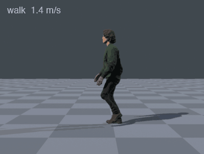

# CharForge

A text prompt or an image goes in; a rigged, animated character comes out that you can drop into
a game engine — glTF and FBX, Mixamo skeleton, PBR textures, level-of-detail meshes and a manifest
of everything a character controller needs. Everything runs locally on an Apple Silicon laptop:
image generation, 3D generation, segmentation, retopology, rigging, skinning, retargeting and
packaging.

**[▶ Open the live playground](https://majieddd.github.io/charforge/)** — a small game level with
a kinematic character controller driving the generated characters. <kbd>W</kbd><kbd>A</kbd><kbd>S</kbd><kbd>D</kbd>
jogs, <kbd>Shift</kbd> runs, <kbd>C</kbd> walks, <kbd>Space</kbd> jumps (onto the boxes, off the
platform), <kbd>E</kbd> waves; on a touch screen the stick spans walk to run. Each character is
downloaded only when selected, and the **Download** button fetches its full package.

| | made from | height | triangles (LOD0 / 1 / 2) | package |
|---|---|---|---|---|
| **Rowan** | *"a man in a green bomber jacket with medium-length wavy hair"* | 1.78 m | 58,344 / 23,336 / 8,751 | [rowan.zip](https://github.com/majieddd/charforge/releases/download/v2.0.0/rowan.zip) |
| **Wren** | *"a woman in a brown leather jacket with a satchel and a braid"* | 1.68 m | 58,840 / 23,536 / 8,824 | [wren.zip](https://github.com/majieddd/charforge/releases/download/v2.0.0/wren.zip) |
| **Juno** | *"a woman in a red hooded windbreaker, grey cargo trousers and black hiking boots, with a short black bob haircut"* — generated end to end by one `charforge.py make`, untouched | 1.70 m | 58,392 / 23,355 / 8,757 | [juno.zip](https://github.com/majieddd/charforge/releases/download/v2.0.0/juno.zip) |
| **Vex** | no prompt: a painted concept image with a city street behind her, given as `--image` | 1.72 m | 59,336 / 23,731 / 8,899 | [vex.zip](https://github.com/majieddd/charforge/releases/download/v2.0.0/vex.zip) |

Vex is the hard case, and looks it: a digital painting with a busy background is further from
what the 3D generator was trained on than a clean reference render, and she carries more texture
smearing than the other three. She also found two defects no clean input had: knees close enough
to weld in the remesh, and pink hair that the face-rescue rule took for skin. Both are fixed for
every character now (see [REVIEW.md](REVIEW.md), findings 24 and 25).

<p align="center">
  
</p>

## What you get

`python charforge.py make --name juno --prompt "..."` writes `out/juno/`:

| file | what it is |
|---|---|
| `juno.glb` | the character: mesh, 25-bone Mixamo skeleton, baked PBR material, six clips — for Unreal, Godot, three.js and anything else that reads glTF |
| `juno.fbx` | the same for Unity, with `_LOD0`/`_LOD1`/`_LOD2` meshes that Unity turns into an LOD Group on import |
| `textures/` | 4K `albedo`, `normal` (OpenGL) and `normal_directx` (Unreal), `orm` (occlusion/roughness/metallic), and Unity's `metallic_smoothness` + `occlusion` |
| `juno.json` | the manifest: height, collision capsule, and per clip its length, whether it loops, the ground speed it was authored at, where the left foot strikes in the cycle, and for the jump its takeoff, landing, apex and a responsive entry point |
| `reference.png` | the image the character was generated from |

**Conventions**, as an engine expects them: metres, Y-up in glTF, facing +Z; origin on the floor
under the pelvis; T-pose rest; bones named `mixamorig:*`, so Unity's Humanoid mapper and every
Mixamo retargeting preset recognise them; clips baked at 60 fps **in place**, with the speed to
move the character at recorded in the manifest.

**The clips** are idle, walk (1.4 m/s), jog (2.3 m/s), run (4.1 m/s), jump and wave — Mixamo
captures, chosen by measurement and retargeted with the feet planted (see below). Walk, jog and
run share a stride phase, so a controller can blend them by speed without the legs crossing.

**Engine setup** is in the manifest (`materials.per_engine`); in short:

- **Unreal** — import the `.glb` or `.fbx`. Base Color = `albedo`, Normal = `normal_directx`,
  and `orm` plugs straight into Unreal's own occlusion/roughness/metallic packing.
- **Unity (URP or Built-in)** — import the `.fbx`, set Rig to *Humanoid* (the names auto-map),
  Base Map = `albedo`, Normal Map = `normal`, Metallic = `metallic_smoothness` (smoothness from
  its alpha), Occlusion = `occlusion`. The clips appear as `Armature|walk` and so on — Blender's
  FBX exporter names takes that way; rename them in the import settings if you like.
- **Godot 4** — import the `.glb`; materials and animations are wired, and Godot builds LODs.

## Make your own

```bash
python charforge.py make --name juno --height 1.70 --prompt "a woman in a red hooded windbreaker"
python charforge.py make --name vex  --height 1.80 --image concept_art.png
python charforge.py stages          # what each stage does and writes
```

A prompt is first turned into a reference image (Krea 2 in ComfyUI); an image is used as given —
TRELLIS removes the background and crops. A full run takes 12–25 minutes on an M-series
laptop, most of it the two TRELLIS passes (about four minutes each) and the image model; Juno took
26 with the machine short of memory. Every stage writes its output to `work/<name>/` and is skipped next time if that output
exists, so `--from <stage>` re-runs from any point and `--until <stage>` stops early.
`--quality fast` skips the second, multi-view generation pass.

| stage | what happens | script |
|---|---|---|
| reference | prompt → full-body reference image, or your image copied as is | `pipeline/comfy.py` |
| generate | TRELLIS.2-4B via MLX, image → textured mesh | `vendor/trellis2mlx` |
| multiview | side and back views rendered, repainted by an image model, and fed back as **stochastic multi-view conditioning** — a different view conditions each denoising step, the scheme TRELLIS was trained on | `blender/render_views.py`, [patch](patches/) |
| views, parts | eight orbit renders; a human parser per view, back-projected with exact visibility to per-vertex body / clothing / hair / accessory labels | `pipeline/parts.py` |
| skeleton | joints estimated from the orbit renders and triangulated | `pipeline/skeleton.py` |
| retopo | watertight quad mesh, with legs the remesh welded together cut apart along the skeleton; 4K albedo, normal, roughness/metallic and AO baked from the high-resolution surface | `blender/retopo.py` |
| labels | part labels carried onto the clean mesh | `pipeline/transfer_labels.py` |
| texclean | skin the generator painted onto clothing — islands of skin tone in the fabric, far from any skin on the mesh — filled from the fabric around it | `pipeline/texture_cleanup.py` |
| rig | armature built, skin weights solved; shoes held rigid below the ankle, each leg bound to its own bones only | `blender/rig_retopo.py` |
| frame | metres, soles on the floor, origin under the pelvis | `blender/normalize_frame.py` |
| tpose | rest pose baked to a T | `blender/tpose.py` |
| animate | clips retargeted: heading from travel, pelvis sway kept, feet grounded and planted with leg IK | `blender/retarget.py` |
| smooth | the weight field softened where it is steepest | `blender/smooth_hotspots.py` |
| package | Mixamo names, glTF + FBX with LODs, engine texture variants, manifest | `blender/package.py` |
| web | 2K WebP build for the browser, thumbnail | `tools/optimize_glb.py`, `blender/thumbnail.py` |

## Measured, not asserted

Every number here comes from a script in this repository. The adversarial review that drove the
current rebuild is in [REVIEW.md](REVIEW.md); the running task list, including what was tried
and rejected, is in [CONTRIBUTING.md](CONTRIBUTING.md).

**Feet stay where they are put.** Measured on the deformed shoe mesh — the vertices actually
touching the floor — with the character driven by the playground's own controller. Re-run it in
the playground's console with `await __cf.footAudit()`, or offline on any build with
`blender -b --python blender/foot_audit.py -- --blend work/<name>/final.blend --report work/<name>/retarget.json`:

| | before this rebuild | now: Rowan | Wren | Juno | Vex |
|---|---|---|---|---|---|
| walk, contact slip (share of ground speed) | 30% | 2.2% | 1.9% | 2.3% | 4.3% |
| jog | — | 2.5% | 2.4% | 3.6% | 1.8% |
| run | 79% | 1.6% | 0.8% | 2.2% | 1.7% |
| soles off the floor while planted | 4–5 cm float or sink | < 3 mm | < 3 mm | < 4 mm | < 5 mm |
| heading error of the run | 45° (it ran diagonally) | 0° | 0° | 0° | 0° |

Getting there took five separate fixes, each found by measuring the one before it:

1. **Clip choice.** The run we had shipped travelled at 45° to its own body, and the walk at 13° —
   no rotation can plant such a clip under a controller that moves the way the character faces.
   `blender/scan_locomotion.py` graded all 2,147 short clips in the Mixamo mirror on body/travel
   agreement, straightness, source foot slip and cycle closure; the finalists were judged on
   filmstrips, because a clean score does not rule out a zombie shamble.
2. **Heading from travel, and the pelvis's sway kept.** Making a clip in-place by pinning the
   pelvis throws away its surge and sway, and the planted feet inherit both as slide.
3. **Height from the floor, key by key.** No capture-derived reference holds: frame 0 floated
   the run 4.8 cm, the capture's rest pose sank every clip 4–5 cm.
4. **Foot contact from the capture, planted with IK.** The source knows exactly when each foot
   is down (its own feet slip under 2%). During contact the sole point the foot rolls on is
   pinned and a two-bone leg IK reaches it. On these rigs the skeleton's "ball" joint sits at the
   instep, 9 cm up inside the shoe — pinning it pinned a point in mid-air — so contact is read
   from the mesh sole instead.
5. **Rigid shoes, 60 fps.** The shoe was skinned half to the shin and bent like rubber at every
   ankle flex; below the ankle it now follows the foot. And at 30 fps a run's ground contact is
   4–6 keys — interpolating between them slid the foot 13% in the browser; at 60 fps it is 1–2%.

**Dual quaternion skinning beats any weighting scheme we tried.** Same mesh, same weights, in
the playground's shader (measured on Rowan's earlier build):

| | linear blend | dual quaternion |
|---|---|---|
| jacket faces under half rest area, walk | 8.80% | **6.18%** |
| same, run | 11.49% | **5.96%** |
| skin, walk | 0.79% | **0.11%** |

<p align="center">
  
</p>

**Smooth weights beat "anatomically correct" ones.** Ray-visibility tests, a left/right prior
and a skeleton-graph bound each drove a purity metric to zero and made the character visibly
worse, because each is a binary per-vertex decision and the surface tears where neighbours
disagree. The one weight change that helped softens the field only where it is steep, by a
continuously varying amount.

**The texture carries information, not bytes.** The albedo is upsampled from TRELLIS's native
1024, so the web build ships 2K WebP (lossless for the normal map — a normal is a direction, and
a small error tilts the surface): 29.8 MB → 5.9 MB, each texture checked on the way against the
4K bake (albedo 41.8 dB, normal 39.1 dB, ORM 47.0 dB PSNR). The package keeps the 4K bake. Roughness and metallic come from the generator's own material
prediction, baked, instead of the flat 0.5 the first build shipped.

## Running it

Requires macOS on Apple Silicon, Blender 5.x (on `PATH`, or `$BLENDER`), and Python 3.11+.

```bash
python3 -m venv .venv && .venv/bin/pip install -r requirements.txt
.venv/bin/python tools/check_env.py
```

`check_env.py` reports what is present and what is missing across the three environments this
spans — the host Python, Blender's own interpreter, and the vendored generator — so a gap
surfaces in a second rather than halfway through a run. Generation needs
[trellis2mlx](https://github.com/lyonsno/trellis2mlx) in `vendor/`, with the multi-view patch
applied, and its weights; a text prompt also needs ComfyUI with Krea 2 on `localhost:8188`
(without it, give `--image`). The animation stage reads Mixamo clips from the `jasongzy/Mixamo`
mirror on Hugging Face, by the hashes in `animations/default_clips.json` — point those at your
own Mixamo downloads to change the moves.

```bash
git clone https://github.com/lyonsno/trellis2mlx vendor/trellis2mlx
git -C vendor/trellis2mlx apply ../../patches/trellis2mlx-stochastic-multiview.patch
```

The site and release packages are generated, not hand-assembled:
`python tools/build_site.py` rebuilds `docs/` (GitHub Pages), `web/dist/` (a single-file build
for hosts that will not serve `.glb`) and `dist/*.zip` from `out/` and `web/roster.json`.

## Honest limitations

- **Hands are mittens.** The generator fuses the fingers, so the skeleton has one stub past each
  wrist and no finger bones; hand-held props need a socket on the hand bone.
- **No face rig.** The head moves as one piece — no blendshapes, no jaw.
- **Hair is a solid mass**, and faces are smooth rather than sculpted. That is the generative
  stage; more conditioning views or a finer TRELLIS grid are the levers.
- **Six clips.** Enough to move a character around a level; not a full locomotion set (no turns
  in place, starts and stops, strafes, crouch). Add Mixamo clips to `animations/default_clips.json`.
- **Clothing is skinned, not simulated.** Cloth simulation was built and removed: a baked cloth
  cache ties the garment to one clip and cannot follow a game's blended locomotion.
- **The glTF carries one LOD.** The FBX carries three; glTF has no standard LOD container that
  engines agree on, and Godot and Unreal generate their own.

## Assets and licensing

The **code** is MIT (see [LICENSE](LICENSE)). The **character meshes and textures** are generated
output and carry no third-party rights beyond the generating models' own terms (TRELLIS.2, MIT;
Krea 2 for the reference images).

The **animation clips are derived from Mixamo captures** (via the `jasongzy/Mixamo` mirror) and
retargeted onto each skeleton. Mixamo content is Adobe's; its licence permits use in projects
but not redistribution as stock animation. The clips here ship as part of a demo, which is the
ordinary use case — but for anything commercial, download your own clips from
[mixamo.com](https://www.mixamo.com) and point `animations/default_clips.json` at them. Open an
issue if you are the rights holder and want this removed.

## Repository layout

```
charforge.py  the one entry point: text or image in, game-ready package out
blender/      Blender stages (retopology, rigging, framing, retargeting, packaging) and audits
pipeline/     image generation client, segmentation, skeleton estimation, label transfer
tools/        GLB optimisation, site and release builder, asset audit, environment check
animations/   the default clip set, by Mixamo file hash, with how each was chosen
web/          the playground template and roster; web/dist is the single-file build
docs/         GitHub Pages build of the playground
patches/      the stochastic multi-view conditioning patch for trellis2mlx
results/      rendered comparisons and the raw audit JSON behind the numbers above
attic/        the superseded first pipeline, kept for the measurements made with it
```
